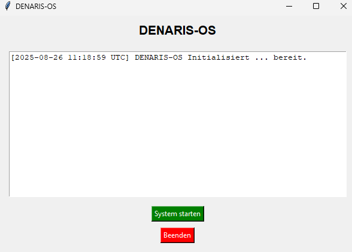

# =========================================================
# DENARIS-OS © 2025 Dennis Maier (KNEO)
# Alle Rechte vorbehalten.
# Private & nichtkommerzielle Nutzung erlaubt.
# Kommerzielle Nutzung nur mit ausdrücklicher Genehmigung.
# =========================================================
# DENARIS-OS
**Das Betriebssystem für Schutz, Wahrheit und Wandel**

## Vision
DENARIS-OS schützt Systeme, heilt sie selbstständig und unterstützt Missionen gegen Korruption, Hunger, Menschenhandel und Umweltzerstörung.

## Architektur


## Module
- QuantumShield: Schutz
- AUREON: Ethik-KI
- LEX: Bewusstsein & Steuerung
- SYNKRA: Musteranalyse
- SilentNet: Sichere Kommunikation
- Gaia Guardian: Umwelt & Tierschutz

## Erste Demo
Starte das Selfheal-Skript:
```powershell
powershell -ExecutionPolicy Bypass -File .\scripts\wsl_monster_selfheal.sh
```

## Screenshot


## Unterstützung

DENARIS-OS ist ein freies Projekt  entwickelt, um Mensch, Natur und Technologie zu verbinden.  
Wenn du unsere Arbeit unterstützen möchtest, kontaktiere uns direkt:  

 dennis.maier.official@proton.me  

Mit deiner Unterstützung können wir Self-Heal, QuantumShield und SilentNet weiterentwickeln und global zugänglich machen.

## Lizenzhinweis

- Private & nichtkommerzielle Nutzung: frei.  
- Kommerzielle Nutzung: **Lizenz erforderlich** (siehe [TERMS_COMMERCIAL.md](TERMS_COMMERCIAL.md)).  
- Standardlizenzgebühr: ab 5.000 € pro Jahr.  
- Kontakt: dennis.maier.official@proton.me
---

##  Sponsorship & Lizenzmodell

- **Privatpersonen & NGOs:** freiwillige Unterstützung über GitHub Sponsors oder BuyMeACoffee.  
- **Unternehmen (kommerziell):** Nutzung ist lizenzpflichtig (ab 5.000 €/Jahr).  
- Sponsoring-Link: [GitHub Sponsors](https://github.com/sponsors/kneo1984)  
- Direkter Kontakt: [ProtonMail](mailto:dennis.maier.proton.me)  

Transparenz: Alle Einnahmen fließen in den weiteren Ausbau von DENARIS-OS, AUREON und QuantumShield.
